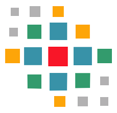

# config-metadata-generator
*Manually way/library to generate config metadata for spring boot*

[![Build][build_shield]][build_link]
[![Maintainable][maintainable_shield]][maintainable_link]
[![Coverage][coverage_shield]][coverage_link]
[![Issues][issues_shield]][issues_link]
[![Commit][commit_shield]][commit_link]
[![Dependencies][dependency_shield]][dependency_link]
[![License][license_shield]][license_link]
[![Central][central_shield]][central_link]
[![Tag][tag_shield]][tag_link]
[![Javadoc][javadoc_shield]][javadoc_link]
[![Size][size_shield]][size_shield]
![Label][label_shield]
![Label][java_version]

### Information
 * [Spring boot configuration-metadata](https://docs.spring.io/spring-boot/docs/current/reference/html/configuration-metadata.html)

### Usage auto configuration classes
* You could generate auto configuration classes out of a test like this

```java

class MetadataGeneratorTest {

    @Test
    public void generateAutoConfigMetadata() {
        final AutoConfigurationClass classList = new AutoConfigurationClass(Groups.class, Hints.class);
        classList.newAutoConfigClass(Values.class, Properties.class);

        final Path generated = classList.generate();

    }
}
```
* Output from example:
```properties
org.springframework.boot.autoconfigure.EnableAutoConfiguration=\
berlin.yuna.configmetadata.model.Groups
berlin.yuna.configmetadata.model.Hints
berlin.yuna.configmetadata.model.Values
berlin.yuna.configmetadata.model.Properties
```

### Usage Configuration Metadata
* You could generate metadata out of a test like this

```java
public class ConfigMetadataGeneratorTest {

    @Test
    public void generateMetadataFromEnum() {
        final ConfigurationMetadata metadata = new ConfigurationMetadata("my.group", ExampleEnumConfig.class);

        for (ExampleEnumConfig c : ExampleEnumConfig.values()) {
            final Class<?> type = c.getDefaultValue().getClass();
            metadata.newProperties().name(c.name().toLowerCase()).description(c.getDescription()).type(type);
        }

        metadata.generate();
    }
}
```
* Test config enum class behind the scenes

```java
public enum ExampleEnumConfig {

    CLUSTER_ID("test-cluster", "Cluster ID (default: test-cluster)"),
    PORT(4222, "Use port for clients (default: 4222)"),
    MAX_BYTES(0L, "Max messages total size per channel (0 for unlimited)"),
    INFO(true, "Enable info output"),
    DEBUG(false, "Debug the raw protocol");

    private final Object defaultValue;
    private final String description;

    ExampleEnumConfig(final Object defaultValue, final String description) {
        this.defaultValue = defaultValue;
        this.description = description;
    }

    public Object getDefaultValue() {
        return defaultValue;
    }

    public String getDescription() {
        return description;
    }
}
```
* output from example:
```json
{
  "hints" : [ ],
  "groups" : [ {
    "name" : "my.group",
    "type" : "berlin.yuna.configmetadata.model.ExampleEnumConfig",
    "sourceType" : "berlin.yuna.configmetadata.model.ExampleEnumConfig"
  } ],
  "properties" : [ {
    "name" : "my.group.cluster_id",
    "type" : "java.lang.String",
    "description" : "Cluster ID (default: test-cluster)",
    "sourceType" : "berlin.yuna.configmetadata.model.ExampleEnumConfig"
  }, {
    "name" : "my.group.port",
    "type" : "java.lang.Integer",
    "description" : "Use port for clients (default: 4222)",
    "sourceType" : "berlin.yuna.configmetadata.model.ExampleEnumConfig"
  }, {
    "name" : "my.group.max_bytes",
    "type" : "java.lang.Long",
    "description" : "Max messages total size per channel (0 for unlimited)",
    "sourceType" : "berlin.yuna.configmetadata.model.ExampleEnumConfig"
  }, {
    "name" : "my.group.info",
    "type" : "java.lang.Boolean",
    "description" : "Enable info output",
    "sourceType" : "berlin.yuna.configmetadata.model.ExampleEnumConfig"
  }, {
    "name" : "my.group.debug",
    "type" : "java.lang.Boolean",
    "description" : "Debug the raw protocol",
    "sourceType" : "berlin.yuna.configmetadata.model.ExampleEnumConfig"
  } ]
}
```




[build_shield]: https://github.com/YunaBraska/config-metadata-generator/workflows/JAVA_CI/badge.svg
[build_link]: https://github.com/YunaBraska/config-metadata-generator/actions?query=workflow%3AJAVA_CI
[maintainable_shield]: https://img.shields.io/codeclimate/maintainability/YunaBraska/config-metadata-generator?style=flat-square
[maintainable_link]: https://codeclimate.com/github/YunaBraska/config-metadata-generator/maintainability
[coverage_shield]: https://img.shields.io/codeclimate/coverage/YunaBraska/config-metadata-generator?style=flat-square
[coverage_link]: https://codeclimate.com/github/YunaBraska/config-metadata-generator/test_coverage
[issues_shield]: https://img.shields.io/github/issues/YunaBraska/config-metadata-generator?style=flat-square
[issues_link]: https://github.com/YunaBraska/config-metadata-generator/commits/master
[commit_shield]: https://img.shields.io/github/last-commit/YunaBraska/config-metadata-generator?style=flat-square
[commit_link]: https://github.com/YunaBraska/config-metadata-generator/issues
[license_shield]: https://img.shields.io/github/license/YunaBraska/config-metadata-generator?style=flat-square
[license_link]: https://github.com/YunaBraska/config-metadata-generator/blob/master/LICENSE
[dependency_shield]: https://img.shields.io/librariesio/github/YunaBraska/config-metadata-generator?style=flat-square
[dependency_link]: https://libraries.io/github/YunaBraska/config-metadata-generator
[central_shield]: https://img.shields.io/maven-central/v/berlin.yuna/config-metadata-generator?style=flat-square
[central_link]:https://search.maven.org/artifact/berlin.yuna/config-metadata-generator
[tag_shield]: https://img.shields.io/github/v/tag/YunaBraska/config-metadata-generator?style=flat-square
[tag_link]: https://github.com/YunaBraska/config-metadata-generator/releases
[javadoc_shield]: https://javadoc.io/badge2/berlin.yuna/config-metadata-generator/javadoc.svg?style=flat-square
[javadoc_link]: https://javadoc.io/doc/berlin.yuna/config-metadata-generator
[size_shield]: https://img.shields.io/github/repo-size/YunaBraska/config-metadata-generator?style=flat-square
[label_shield]: https://img.shields.io/badge/Yuna-QueenInside-blueviolet?style=flat-square
[gitter_shield]: https://img.shields.io/gitter/room/YunaBraska/nats-streaming-server-embedded?style=flat-square
[gitter_link]: https://gitter.im/nats-streaming-server-embedded/Lobby
[java_version]: https://img.shields.io/badge/java-17-blueviolet?style=flat-square
